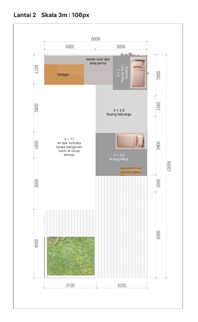

# Meter ↔ Pixel Converter

This is a simple web application that allows users to convert between meters and pixels. It is built using React and TailwindCSS, and provides an intuitive interface for quick and accurate conversions.



## Features

- Convert meters to pixels and vice versa.
- Adjustable base values for meters and pixels.
- Real-time conversion with a clean and responsive UI.

## Installation

To set up the project locally, follow these steps:

1. Clone the repository:
   ```bash
   git clone <repository-url>
   cd project
   ```

2. Install dependencies:
   ```bash
   npm install
   ```

## Running the Application

To start the development server, run:

```bash
npm run dev
```

The app will be available at `http://localhost:3000`.

To build the app for production, use:

```bash
npm run build
```

To preview the production build locally:

```bash
npm run start
```

## Usage

1. Enter the base values for meters and pixels in the respective input fields.
2. Input the value you want to convert.
3. Use the "Switch Direction" button to toggle between meters-to-pixels and pixels-to-meters conversion.
4. The result will be displayed in real-time.

### Example

- **Base Meters:** `1.7`
- **Base Pixels:** `63`
- **Input Value:** `3 meters`

Result: `111.18 pixels`

## Screenshot

Below is a sample screenshot of the app:


---

Feel free to contribute or report issues!